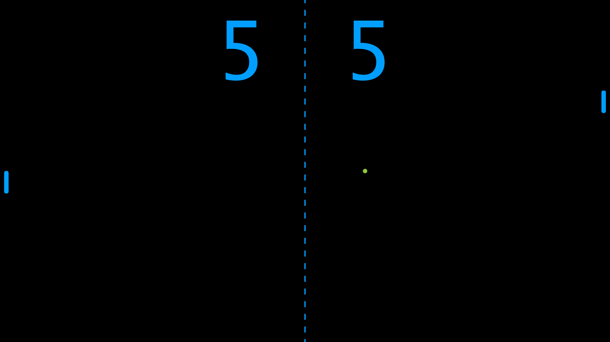

# Pong
A Processing 3.0 implementation of the famous arcade game Pong.

This game is a throwback to the games I made in highchool, two of which can be found [here](https://github.com/BCathcart/Highschool-Processing-Games).

## Requirements

- Source code compiles and runs in [Processing](https://processing.org/download/)

## Game Notes
- The game is fullscreen and scales to any computer screen size
- The game is 1-player against an AI opponent
- Use the **up** and **down** arrow keys to move your paddle
- Currently there is no end to the game; the scores will count up forever
- The ball will speed up in the x direction the longer the point goes on
- The ball's velocity in the y direction is a combination of it's previous velocity and where it hits on the paddle

